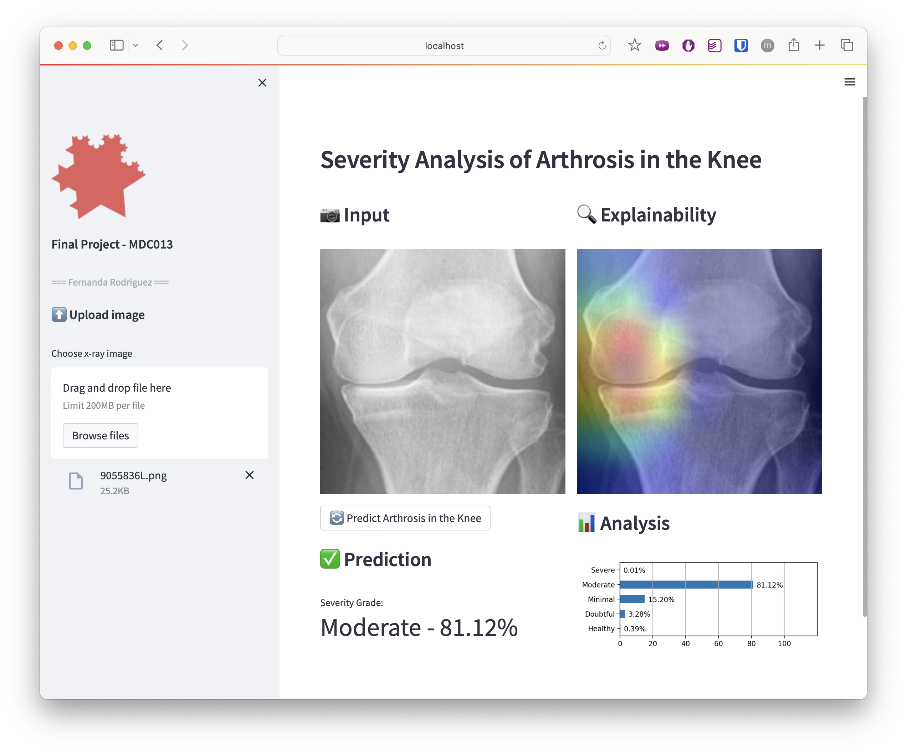
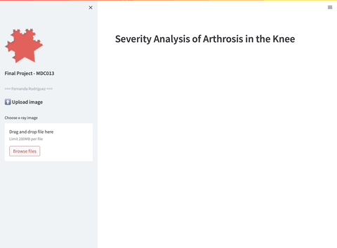

# 🦵 AI-Powered Knee Osteoarthritis Diagnosis from X-ray Images  

  
  
  
  

🚀 **AI-powered system for detecting and grading Knee Osteoarthritis from X-ray images using Deep Learning (ResNet-50).**  
This project provides automated diagnosis, severity classification, hospital locator integration, and personalized diet & exercise recommendations — bridging AI and healthcare for improved patient care.  

---

### Web App Interface  
  

### Live Demo (GIF)  
  
